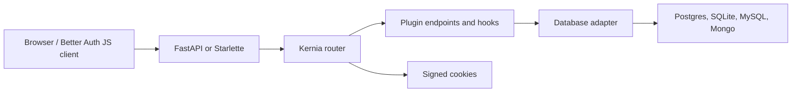

Kernia has a framework-agnostic core and small framework integrations.

The core router receives framework-normalized requests, matches an auth endpoint,
constructs an endpoint context, runs hooks, reads/writes through the adapter, and
serializes the response expected by Better Auth-compatible clients.

## Package boundaries

- `kernia` contains the core router, options, schema, cookies, OAuth helpers, and
  built-in plugins.
- Integration packages mount the router into FastAPI, Starlette, or Django.
- Adapter packages implement the database contract.
- Standalone plugin packages add larger feature surfaces such as API keys, SSO,
  SCIM, passkeys, OAuth provider, Redis storage, and Stripe.

## Design rule

Branding and Python imports use Kernia names. Protocol-level behavior that JS
clients rely on remains Better Auth-compatible.
